# 📱 TaskMate - Flutter Task & Notes Manager

[](https://flutter.dev)
[](https://dart.dev)
[](https://firebase.google.com)
[](https://www.sqlite.org)

## 📖 Description

**TaskMate** is a comprehensive Flutter-based productivity application designed to streamline task and note management. With an intuitive interface and powerful features, TaskMate helps users organize their daily activities, track deadlines, and maintain detailed notes. The app offers both online and offline functionality through Firebase integration and local SQLite storage.

### 🎯 Key Highlights

- **Cross-Platform**: Runs seamlessly on Android, iOS, and Web
- **Offline-First**: Works without internet connectivity using local database
- **Real-time Sync**: Firebase integration for cloud storage and synchronization
- **Rich Features**: Advanced task management, note-taking, and productivity tools
- **Modern UI**: Clean, responsive design with customizable themes

## 📋 Table of Contents

- [✨ Features](#-features)
- [📸 Screenshots](#-screenshots)
- [🛠️ Technologies Used](#️-technologies-used)
- [🔥 Firebase Integration](#-firebase-integration)
- [⚡ Installation & Setup](#-installation--setup)
- [📱 Usage Guide](#-usage-guide)
- [🏗️ Project Structure](#️-project-structure)
- [🤝 Contributing](#-contributing)
- [📄 License](#-license)
- [📞 Contact](#-contact)

## ✨ Features

### 🔐 Authentication & Security

- **Firebase Authentication**: Secure sign up and login with email validation
- **Regex Validation**: Email and password constraints for enhanced security
- **User Profiles**: Customizable profiles with pictures and personal information

### 📝 Advanced Note Management

- **CRUD Operations**: Create, read, update, and delete notes seamlessly
- **Smart Search**: Quick search functionality across all notes
- **Favorites System**: Mark important notes as favorites for easy access
- **Share Functionality**: Share notes with others via various platforms
- **Rich Text Support**: Enhanced text formatting capabilities
- **Voice-to-Text**: Speech recognition for hands-free note creation

### ✅ Comprehensive Task Management

- **Task CRUD**: Full task lifecycle management
- **Calendar Integration**: Visual calendar view for deadline tracking
- **Timeline View**: Chronological task organization
- **Task Categories**: Organize tasks by custom categories
- **Progress Tracking**: Monitor task completion with visual indicators
- **Task Reports**: Generate detailed productivity reports
- **Priority Levels**: Set and manage task priorities
- **Notifications**: Smart reminders for upcoming deadlines

### 🎨 User Experience

- **Theme Customization**: Light and dark theme options
- **Responsive Design**: Optimized for various screen sizes
- **Smooth Animations**: Fluid transitions and interactions
- **Offline Mode**: Full functionality without internet connection
- **Data Backup**: Automatic cloud backup to Firebase
- **Image Support**: Add images to notes and tasks

## 📸 Screenshots

### 🏠 Home & Dashboard

<div align="center">
  
  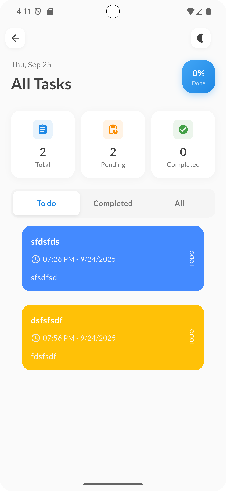
  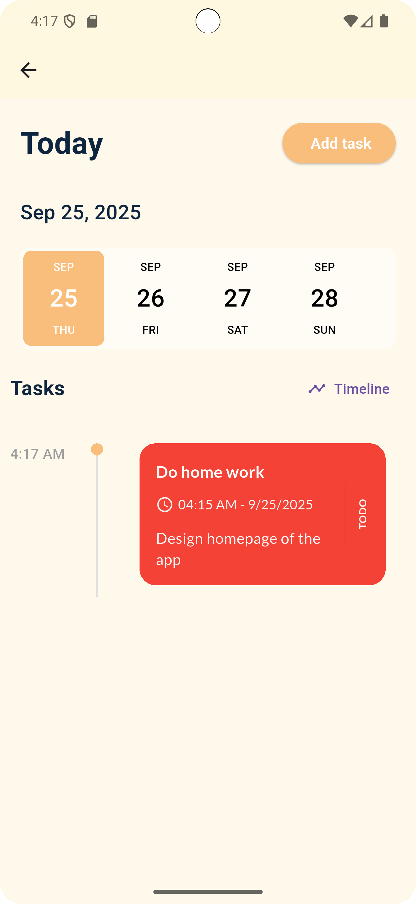
</div>

### ✅ Task Management

<div align="center">
  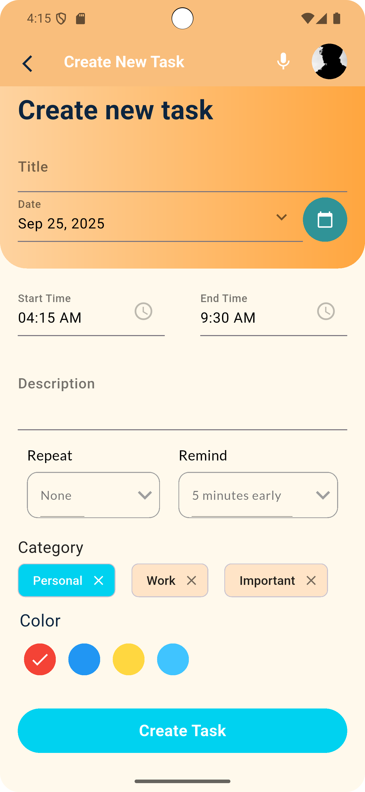
  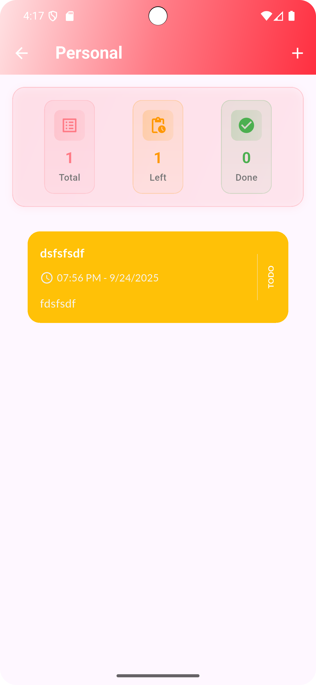
  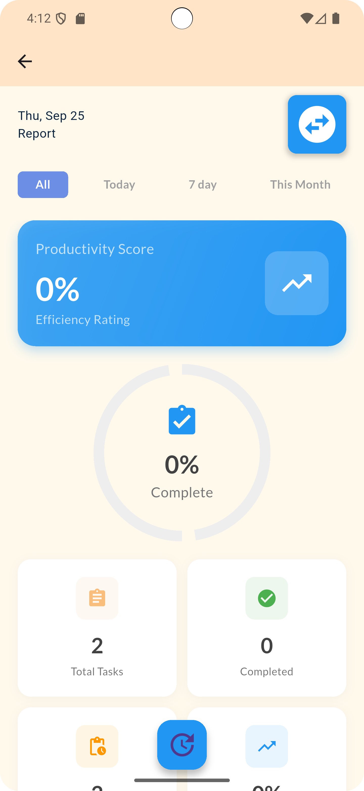
</div>

### 📝 Notes Management

<div align="center">
  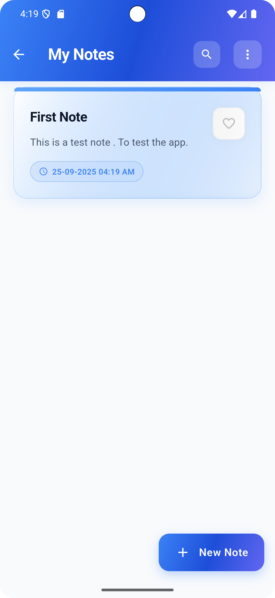
  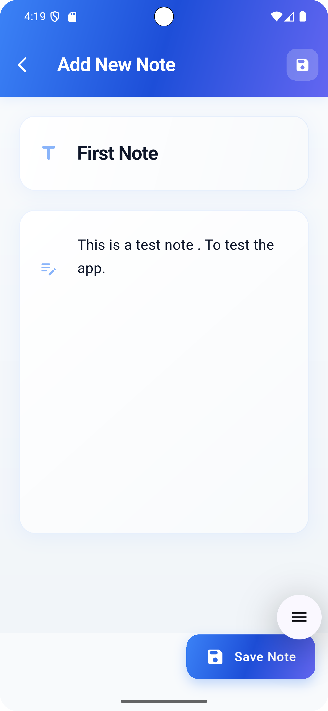
  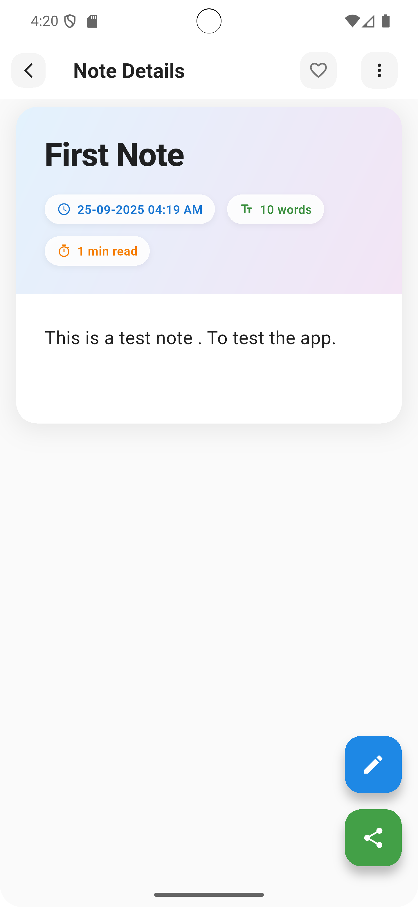
</div>

### 🔍 Search & Categories

<div align="center">
  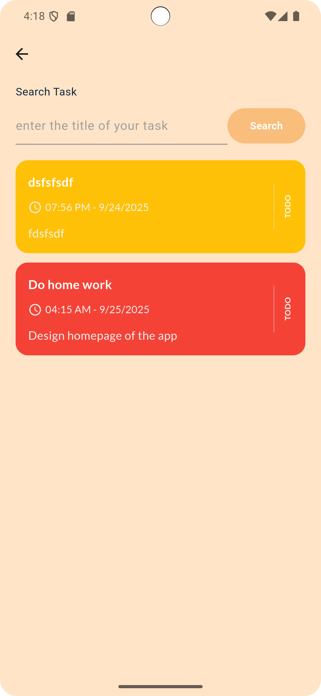
  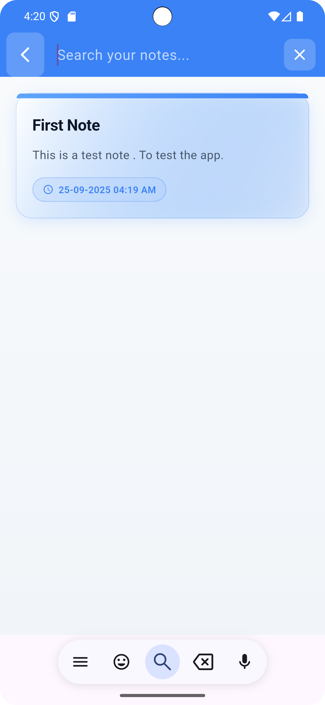
  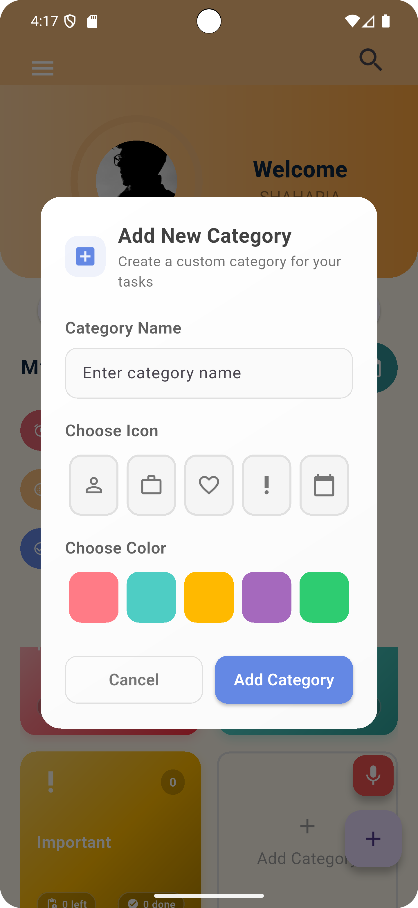
</div>

### ⚙️ Settings & Profile

<div align="center">
  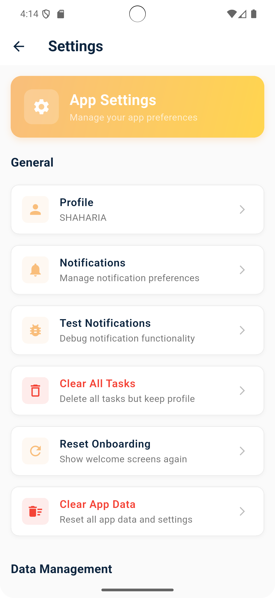
  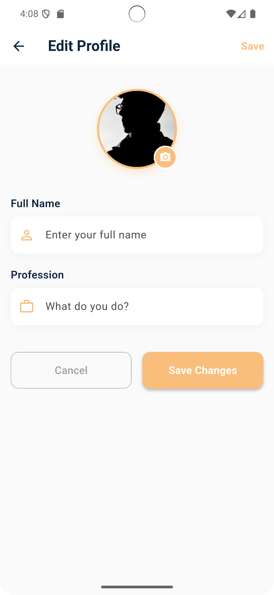
  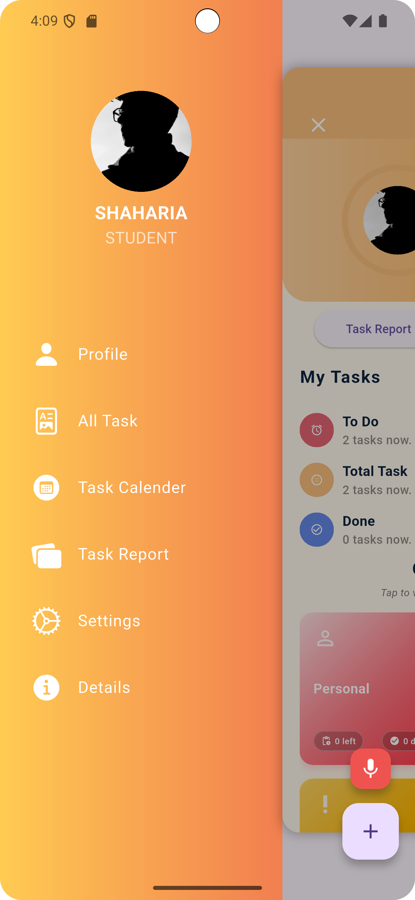
</div>

### ✏️ Editing Features

<div align="center">
  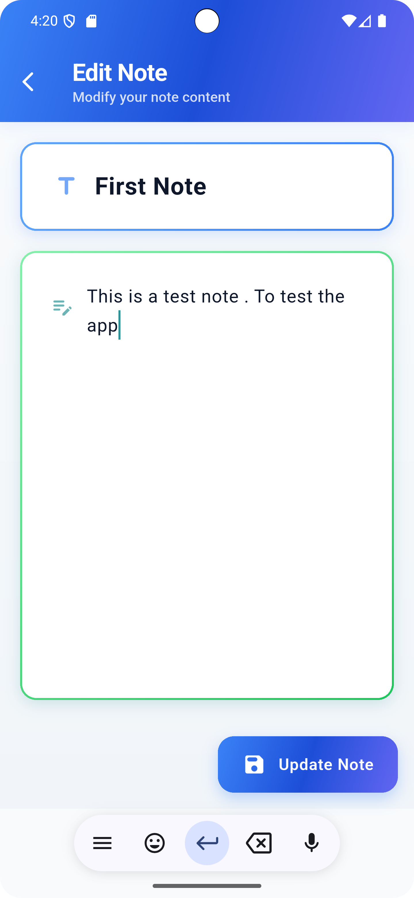
</div>

## 🛠️ Technologies Used

### 🎯 Core Framework

- **[Flutter](https://flutter.dev/)** `>=3.3.0` - Cross-platform UI toolkit
- **[Dart](https://dart.dev/)** - Programming language optimized for UI

### 🗄️ Data & Storage

- **[Firebase Firestore](https://firebase.google.com/products/firestore)** - Cloud NoSQL database
- **[Firebase Authentication](https://firebase.google.com/products/auth)** - User authentication service
- **[SQFlite](https://pub.dev/packages/sqflite)** `^2.4.2` - Local SQLite database
- **[Shared Preferences](https://pub.dev/packages/shared_preferences)** `^2.3.4` - Local key-value storage

### 🎨 UI & UX Libraries

- **[GetX](https://pub.dev/packages/get)** `^4.7.2` - State management and navigation
- **[Google Fonts](https://pub.dev/packages/google_fonts)** - Custom typography
- **[Flutter SVG](https://pub.dev/packages/flutter_svg)** `^2.2.1` - SVG rendering support
- **[Icons Flutter](https://pub.dev/packages/icons_flutter)** `^0.0.5` - Extended icon library
- **[Percent Indicator](https://pub.dev/packages/percent_indicator)** `^4.2.5` - Progress indicators
- **[Step Progress Indicator](https://pub.dev/packages/step_progress_indicator)** `^1.0.2` - Step-based progress tracking
- **[Liquid Progress Indicator](https://pub.dev/packages/liquid_progress_indicator_v2)** `^0.5.0` - Animated progress indicators
- **[Flutter Staggered Animations](https://pub.dev/packages/flutter_staggered_animations)** `^1.1.1` - Animation utilities
- **[Flutter Slidable](https://pub.dev/packages/flutter_slidable)** `^4.0.1` - Slidable list items

### 📅 Date & Time

- **[Date Picker Timeline](https://pub.dev/packages/date_picker_timeline)** `^1.2.7` - Timeline date picker
- **[Intl](https://pub.dev/packages/intl)** `^0.20.2` - Internationalization and localization

### 🔧 Functionality Libraries

- **[Path Provider](https://pub.dev/packages/path_provider)** `^2.1.5` - File system path access
- **[Image Picker](https://pub.dev/packages/image_picker)** `^1.2.0` - Camera and gallery access
- **[Share Plus](https://pub.dev/packages/share_plus)** `^12.0.0` - Native sharing functionality
- **[Permission Handler](https://pub.dev/packages/permission_handler)** `^12.0.1` - Runtime permissions
- **[Speech to Text](https://pub.dev/packages/speech_to_text)** `^7.3.0` - Voice recognition
- **[Flutter TTS](https://pub.dev/packages/flutter_tts)** `^4.2.3` - Text-to-speech functionality
- **[Fluttertoast](https://pub.dev/packages/fluttertoast)** `^9.0.0` - Toast notifications

### 🔔 Notifications

- **[Flutter Local Notifications](https://pub.dev/packages/flutter_local_notifications)** `^19.4.2` - Local push notifications
- **[Timezone](https://pub.dev/packages/timezone)** `^0.10.1` - Timezone handling for notifications

## 🔥 Firebase Integration

TaskMate leverages Firebase as its cloud backend solution, providing robust and scalable data management.

### 📊 Data Architecture

#### 👥 Users Collection

```json
{
  "userId": "string",
  "username": "string",
  "email": "string",
  "profilePicture": "string",
  "profession": "string",
  "createdAt": "timestamp",
  "updatedAt": "timestamp"
}
```

#### 📝 Notes Collection

```json
{
  "noteId": "string",
  "userId": "string",
  "title": "string",
  "content": "string",
  "isFavorite": "boolean",
  "category": "string",
  "createdAt": "timestamp",
  "updatedAt": "timestamp"
}
```

#### ✅ Tasks Collection

```json
{
  "taskId": "string",
  "userId": "string",
  "title": "string",
  "description": "string",
  "dueDate": "timestamp",
  "priority": "string",
  "status": "string",
  "category": "string",
  "isCompleted": "boolean",
  "createdAt": "timestamp",
  "updatedAt": "timestamp"
}
```

### 🔒 Security Features

- **Authentication Rules**: Email/password authentication with validation
- **Firestore Security Rules**: User-specific data access control
- **Data Encryption**: All data transmitted securely via HTTPS
- **Offline Persistence**: Local caching for offline access

### ⚡ Real-time Features

- **Live Data Sync**: Instant updates across all user devices
- **Conflict Resolution**: Automatic handling of concurrent edits
- **Optimistic Updates**: Immediate UI feedback with server sync

## ⚡ Installation & Setup

### 📋 Prerequisites

Before you begin, ensure you have the following installed:

- **Flutter SDK** `>=3.3.0` - [Installation Guide](https://flutter.dev/docs/get-started/install)
- **Dart SDK** (bundled with Flutter)
- **Android Studio** or **VS Code** with Flutter extensions
- **Git** for version control

### 🚀 Quick Start

1. **Clone the Repository**

   ```bash
   git clone https://github.com/alamin-alshaharia/task-mate.git
   cd task-mate
   ```

2. **Install Dependencies**

   ```bash
   flutter pub get
   ```

3. **Firebase Setup** (Optional - for cloud features)

   ```bash
   # Install Firebase CLI
   npm install -g firebase-tools

   # Login to Firebase
   firebase login

   # Initialize Firebase project
   firebase init
   ```

4. **Run the Application**

   ```bash
   # Debug mode
   flutter run

   # Release mode
   flutter run --release
   ```

### 🔧 Build for Production

#### Android APK

```bash
flutter build apk --release --split-per-abi
```

#### iOS App

```bash
flutter build ios --release
```

#### Web Application

```bash
flutter build web --release
```

## 📱 Usage Guide

### 🏠 Getting Started

1. **Launch the App**: Open TaskMate on your device
2. **Create Account**: Sign up with your email or log in if you have an account
3. **Setup Profile**: Add your profile picture, name, and profession
4. **Start Organizing**: Begin creating tasks and notes

### ✅ Task Management

- **Create Tasks**: Tap the "+" button to add new tasks
- **Set Deadlines**: Choose dates and times for your tasks
- **Categorize**: Organize tasks by categories (Work, Personal, etc.)
- **Track Progress**: Monitor completion with visual indicators
- **Generate Reports**: View productivity statistics and trends

### 📝 Note Taking

- **Quick Notes**: Jot down ideas instantly
- **Voice Notes**: Use speech-to-text for hands-free note creation
- **Rich Formatting**: Add images and format text
- **Search & Filter**: Find notes quickly with smart search
- **Share Notes**: Export and share with others

## 🏗️ Project Structure

```
lib/
├── controller/          # GetX controllers for state management
├── db/                  # Local database helpers and models
├── mixins/              # Reusable code mixins
├── model/               # Data models
├── screens/             # UI screens
│   ├── note_screens/    # Note-related screens
│   ├── task_screen/     # Task-related screens
│   └── settings/        # Settings and profile screens
├── service/             # Business logic services
├── theme/               # App theming and styling
├── utils/               # Utility functions and helpers
├── widgets/             # Reusable UI components
│   ├── common/          # Common widgets
│   ├── modular/         # Modular components
│   └── task_widget/     # Task-specific widgets
└── main.dart            # App entry point
```

### 🗂️ Key Components

- **Controllers**: Handle business logic and state management using GetX
- **Models**: Define data structures for Tasks, Notes, and User profiles
- **Services**: Manage notifications, database operations, and external APIs
- **Widgets**: Custom UI components for consistent design
- **Database**: Local SQLite storage for offline functionality

## 🤝 Contributing

We welcome contributions to TaskMate! Here's how you can help:

### 🐛 Bug Reports

1. Check existing issues first
2. Create detailed bug reports with steps to reproduce
3. Include screenshots and device information
4. Use the bug report template

### ✨ Feature Requests

1. Discuss new features in Issues first
2. Provide clear use cases and benefits
3. Consider backward compatibility
4. Follow the feature request template

### 💻 Code Contributions

1. **Fork** the repository
2. **Create** a feature branch: `git checkout -b feature/amazing-feature`
3. **Commit** your changes: `git commit -m 'Add amazing feature'`
4. **Push** to the branch: `git push origin feature/amazing-feature`
5. **Open** a Pull Request

### 📝 Development Guidelines

- Follow [Flutter style guide](https://dart.dev/guides/language/effective-dart/style)
- Write comprehensive tests for new features
- Update documentation as needed
- Ensure backward compatibility
- Use conventional commit messages

## 📄 License
Copyright (c) 2024 Md. Alamin Al Shaharia. All rights reserved.

This code is provided for educational and reference purposes only. 
While you may fork this repository on GitHub for personal study, 
you may not use, copy, modify, or distribute the code without permission.

**This project is not licensed under any open source license.**.

## 📞 Contact

### 👨‍💻 Developer Information

- **Name**: Alamin Al Shaharia
- **GitHub**: [@alamin-alshaharia](https://github.com/alamin-alshaharia)
- **Repository**: [task-mate](https://github.com/alamin-alshaharia/task-mate)

### 🐛 Support & Issues

- **Issues**: [GitHub Issues](https://github.com/alamin-alshaharia/task-mate/issues)
- **Discussions**: [GitHub Discussions](https://github.com/alamin-alshaharia/task-mate/discussions)

### 📧 Contact Methods

For questions, suggestions, or collaborations, please:

1. Open an issue on GitHub
2. Start a discussion in the repository
3. Create a pull request for contributions

---

## 🙏 Acknowledgements

### 📚 Libraries & Frameworks

Special thanks to the open-source community and the maintainers of:

- [Flutter Team](https://flutter.dev/) for the amazing framework
- [Firebase](https://firebase.google.com/) for backend services
- [GetX](https://pub.dev/packages/get) for state management
- All the package maintainers listed in our dependencies

### 🎨 Design Inspiration

- Material Design guidelines
- iOS Human Interface Guidelines
- Modern productivity app UX patterns

### 🔧 Development Tools

- **Android Studio** / **VS Code** for development
- **Firebase Console** for backend management
- **GitHub** for version control and collaboration

---

<div align="center">

### ⭐ If you found this project helpful, please give it a star

[](https://github.com/alamin-alshaharia/task-mate/stargazers)
[](https://github.com/alamin-alshaharia/task-mate/network/members)

**Made with ❤️ using Flutter**

</div>
